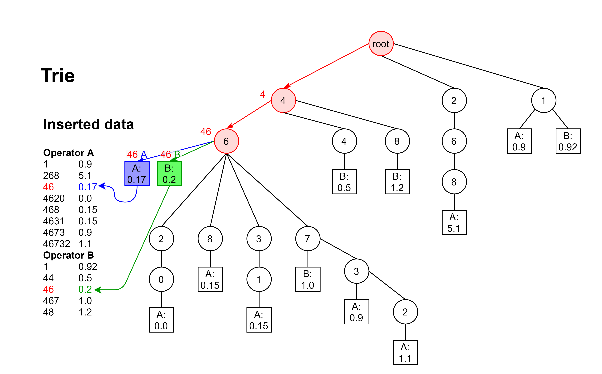
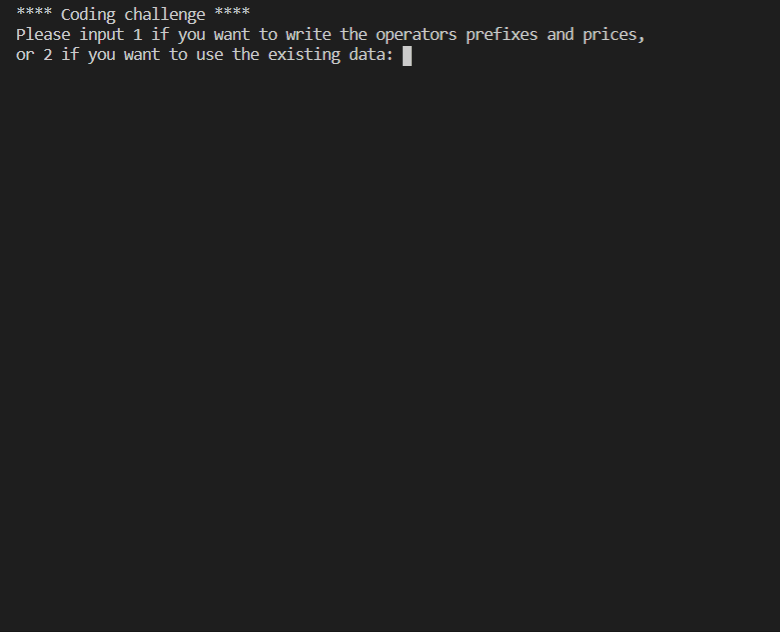

# ICSS Coding Challenge
This is the repository where you can find my solution to the alaTest/ValueChecker (ICSS) challenge 2021 and my CV.

## Author :black_nib:
### Yhoan Alejandro Guzmán García
> yaguzmang@eafit.du.co
### CV:
[Resume Yhoan Alejandro Guzman Garcia](CV/Resume_Yhoan_Alejandro_Guzman_Garcia.pdf)
### Relevant code examples:
> [Fish store - code](https://github.com/jsperezsalazar2001/AquaLife)

I can not share the code of other projects since the codebases are not public and I am under an NDA.

## Routing of telephone calls - The challenge :memo:
The challenging part of routing telephone calls in this context is to handle any number of operators with thousands of price entries and then calculate the cheapest operator for a certain number. 

Even though all entries fit into memory, it is important to have a way to store the data least redundantly. For example, if we were to traditionally store the entries '46' and '467', we would need to store two different prefixes, while the only difference is the '7' at the end. The same happens when calculating the best price. We would need to look at the prefixes '46' and then '467', while the only difference is the '7' at the end.

## The solution :bulb:
### Storing the data:
My solution, accounting for the mentioned challenges, is a data structure similar to a Trie. This data structure solves the redundant data and lookups:

**Image 1** - Data structure

This data structure considerably lowers the memory usage as it inserts prefixes by only adding the non-existing numbers. It also allows handling any number of operators. As seen in the image, it is possible to differentiate operators by adding the operator:price pairs in the digit nodes.
### Finding the cheapest operator:
To find the cheapest operator, we need to traverse the Trie following the number. When we encounter a node that contains operator:price pairs, we know that those operators support the current number. After finding the supported prefixes and their prices and operators, it is only a matter of picking the cheapest. It is important to note that the supported prefixes found are the longest matching prefixes per operator.

Here you can see how the algorithm works:

**Image 2** - Finding the cheapest operator
### Asymptotic Computational Complexity of the solution:
The cost of inserting prefixes and finding the cheapest operator is `O(phone_length) + O(number_operators)`. In comparison, a regular list lookup would cost `O(N)`, where N is the total number of entries.

When it comes to the memory complexity, the upper bound is `O(m*n)`, where `m` is the average length of the prefixes and `n` is the number of prefixes. This upper bound is only met in edge cases. The average memory consumption would be much lower as many prefixes can share numbers in common.

From the Asymptotic Computational Complexity analysis, we can conclude that the solution is very efficient. The only trade-off with a regular list implementation is the insertion cost. Inserting in a list costs only `O(1)`, but insertion only happens once per prefix, so the trade-off makes sense. 

## Application (command line) demo :computer:
